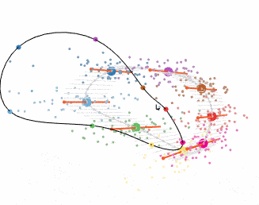

Demo Matlab code for finding neural engagement in your own data.
See `demo.m` for example usage.

For more details, see ["Learning is shaped by abrupt changes in neural engagement"](https://www.nature.com/articles/s41593-021-00822-8) by Hennig et al. (2021).
